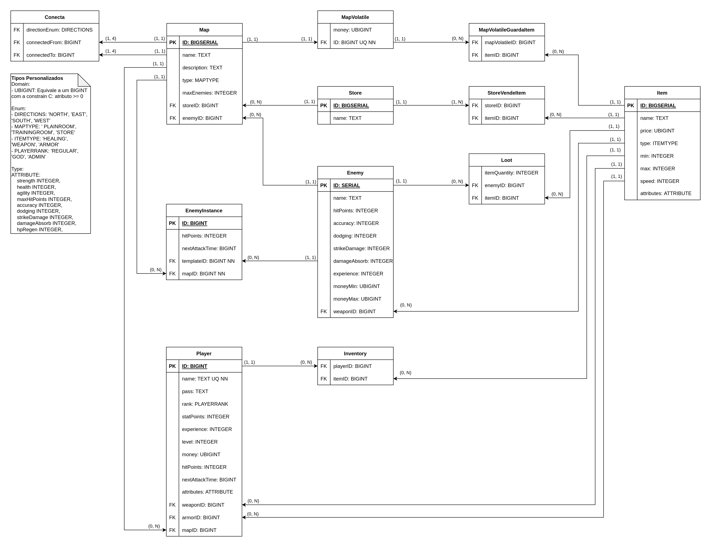

# Banco de Dados

|  **Data**  | **Versão** | **Descrição** | **Autor(es)** |
| ---------- | ---------- | ------------- | ------------- |
| 17/05/2023 |  1.0   | Criação do documento de Banco de Dados | [Iuri Severo](https://github.com/iurisevero) |

Este documento tem como objetivo reunir os artefatos gerados para adição de um banco de dados relacional ao MUD desenvolvido.

## Introdução

No SimpleMUD, desenvolvido por Ron Peton, a persistência de dados era realizada por meio de arquivos formatados no padrão "[NOME DA VARIAVEL] VALOR". Para o UnMUD será realizada uma atualização dessa persistência, passando de arquivos para um banco relacional, mais especificamente, o PostgreSQL. A escolha do banco utilizado se deu em virtude da ementa estudada na matéria de Bancos de Dados 1, da Faculdade do Gama.

Para realizar a modelagem do banco, foram realizadas análises nos arquivos de dados, assim como nos códigos responsáveis pela leitura e escrita desses arquivos, e entidades implementadas no jogo. A partir disso foi possível criar um Diagrama Entidade Relacionamento (DER) e um Diagrama Lógico.

## Diagrama Entidade-Relacionamento (DER)

O Diagrama Entidade-Relacionamento é um modelo conceitual que representa os elementos do domínio do problema, desconsiderando as questões técnicas. Ele gera uma representação gráfica de fácil compreensão do sistema analisado (Barcelar, 2012).

## Diagrama Lógico

O Diagrama Lógico representa o modelo criado de maneira menos abstrata e com uma visão mais próxima de como se dará a implementação do banco de dados em si. Ele é composto por tabelas, que possuem atributos com tipos definidos e apresenta chaves primárias e estrangeiras.

Para mapeamento da generalizações foram utilizadas a regras definidas por Bagui, no capítulo "Mapping Generalizations and Specializations and Categories to Relational Databases", do livro "Handbook of Research on Innovations in Database Technologies and Applications: Current and Future Trends".

## Referências
* Barcelar, Ricardo R. (2012). Banco de Dados. Disponível em: <https://www.academia.edu/download/35243840/BANCO_DE_DADOS__1_-_Introducao_ao_Estudo_de_Bancos_de_Dados_-_Ricardo_Barcelar_-_2014.pdf>.Acessado em Maio de 2023.
* Bagui, Sikha. (2009). Mapping Generalizations and Specializations and Categories to Relational Databases