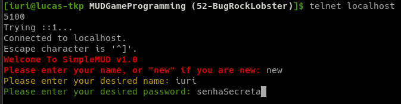
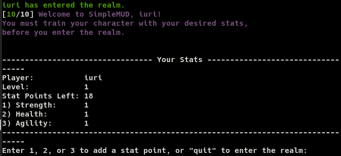
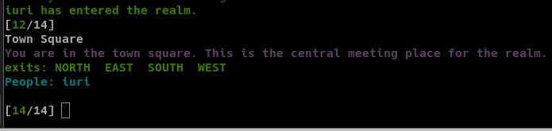
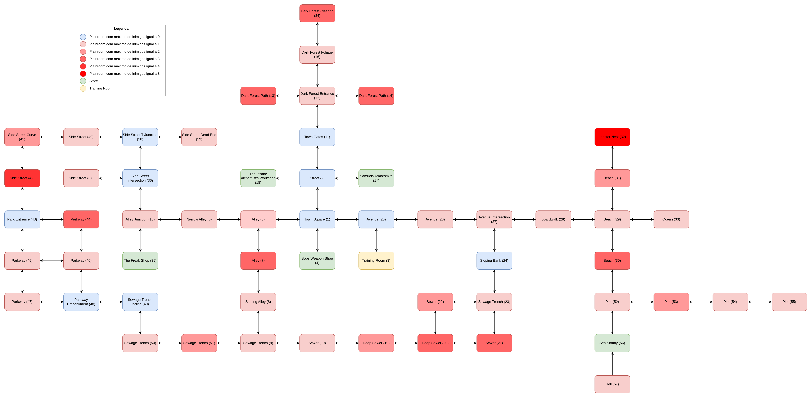

# Como jogar

|  **Data**  | **Versão** | **Descrição** | **Autor(es)** |
| ---------- | ---------- | ------------- | ------------- |
| 01/08/2023 |  1.0   | Criação do documento de como jogar | [Iuri Severo](https://github.com/iurisevero) |

O SimpleMUD, como o nome diz, é um MUD simples, que não possui história, mas que permite ao jogador explorar um pequeno mapa, enfrentar uma variedade de inimigos e encontrar ou comprar diversos items. Para se conectar ao jogo é necessário conexão com a rede onde o jogo está disponibilizado e que o computador possua uma ferramente de rede de computadores que permita a leitura e gravação de dados em conexões de rede utilizando os protocolos _Transmission Control Protocol_ (TCP) ou _User Datagram Protocol_ (UDP), como a NetCat ou a Telnet. Tendo a ferramenta instalada é possível realizar a conexão utilizando o _Internet Protocol_ (IP) e porta do servidor onde o jogo está rodando. O comando utilizando o telnet para uma conexão local na porta 5100 seria:

```
telnet 127.0.0.1 5100
```

A figura abaixo apresenta a tela inicial do SimpleMUD. Ao se conectar ao jogo é possível acessar o mundo por meio de uma conta já existente ou criar uma conta nova, enviando a palavra ```new```. Caso uma nova conta seja criada, é necessário adicionar pontos de atributos para o jogador, dividindo-os entre força, agilidade e vida, apresentado na figura "Adição de atributos". Esses atributos podem ser divididos igualmente em cenários onde o jogador não possui familiaridade com o estilo do jogo.





Após distribuir os pontos de atributo o mundo virtual é apresentado para o jogador, que surge em _"Town Square"_, o centro da cidade inicial, ou na última posição onde esteve, caso ele esteja se conectando com uma conta já existente. Os locais do mapa são representados por um nome, seguido de uma descrição e as direções para onde o jogador pode andar (norte, sul, oeste ou leste). Também são listados os jogadores e inimigos que estão naquela posição do mapa. A figura "Descrição de local do mapa" apresenta o texto de descrição uma posição do mapa.



A partir desse ponto o jogador está livre para explorar o mundo conforme desejar. Para se movimentar basta enviar a direção que deseja ir, como _"North"_ para ir para o norte. Outros comandos úteis são o _"attack"_ que ataca inimigos próximos e o _"help"_ que lista todos comandos do jogo. Por fim, caso o jogador queira encerrar sua sessão, basta enviar o comando _"quit"_ que ele será desconectado do servidor. 

Para auxiliar na exploração do jogo foi desenvolvido um mapa do mundo do SimpleMUD, que lista todos locais existentes (Figura "Mapa do SimpleMUD"). As áreas vermelhas indicam locais onde é possível encontrar inimigos, sendo que quanto mais forte o vermelho, mais inimigos podem ser encontrados naquela posição. As áreas roxas são referentes a locais seguros, sem inimigos. As lojas são representadas pela cor verde e a sala de treinamento é representada pela cor amarela.


