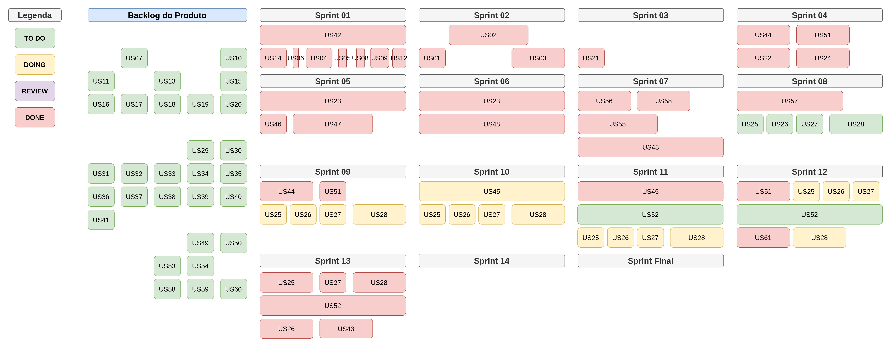

# Roadmap

|  **Data**  | **Versão** | **Descrição** | **Autor(es)** |
| ---------- | ---------- | ------------- | ------------- |
| 10/04/2023 |    1.0     | Adição do rascunho do Roadmap do projeto | [Iuri Severo](https://github.com/iurisevero/) |

Idealmente, as tarefas realizadas em cada sprint devem ser definidas no Sprint Backlog, montado no inicio de cada ciclo do Scrum. No entanto, foi desenvolvido um rascunho de Roadmap para que houvesse uma base de quais histórias de usuário realizar a cada iteração. Após o fim do desenvolvimento, o Roadmap das atividades realizadas será adicionado para que se possa ter o rastreio do que foi alcançado durante o desenvolvimento.

## Roadmap Estimado

## Roadmap Final

## Referências

* Pagotto, Tiago, et al. "Scrum solo: Software process for individual development." 2016 11th Iberian Conference on Information Systems and Technologies (CISTI). IEEE, 2016.
